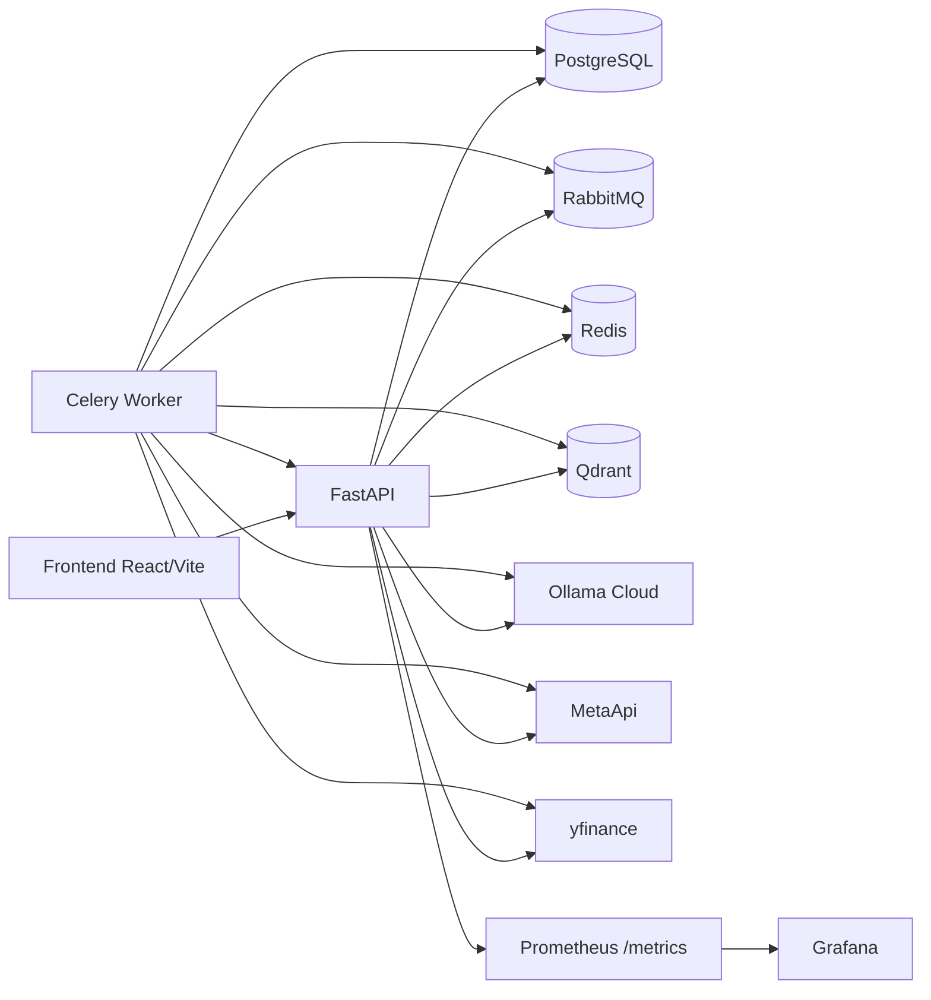
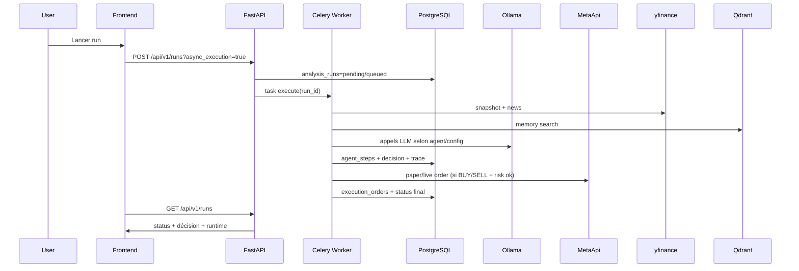

# Architecture technique V1

## Périmètre

- Classe d'actifs: Forex uniquement (V1).
- Paires supportées: `EURUSD`, `GBPUSD`, `USDJPY`, `USDCHF`, `AUDUSD`, `USDCAD`, `NZDUSD`, `EURJPY`, `GBPJPY`, `EURGBP`.
- Timeframes supportés: `M5`, `M15`, `H1`, `H4`, `D1`.
- Décisions: `BUY`, `SELL`, `HOLD`.

## Vue composants

## Services principaux

- `backend/app/api`: routes REST (`/runs`, `/backtests`, `/connectors`, `/prompts`, `/analytics`, `/trading`).
- `backend/app/services/orchestrator`: orchestration multi-agent et persistence `agent_steps`.
- `backend/app/services/llm`: client Ollama avec tentatives automatiques + logs coût/latence + mode dégradé.
- `backend/app/services/market`: provider yfinance (snapshot, historique, news).
- `backend/app/services/trading`: MetaApi SDK puis repli REST.
- `backend/app/services/execution`: séparation `simulation`, `paper`, `live`.
- `backend/app/services/risk`: règles de taille/risque et blocages.
- `backend/app/services/prompts`: prompts versionnés/activables en base.
- `backend/app/services/memory`: mémoire vectorielle (Qdrant + repli SQL cosine), filtrée par `pair` et `timeframe`.
- `backend/app/services/backtest`: stratégies `agents_v1` et `ema_rsi`.

## Flux run (temps réel)

## Flux backtest

- Endpoint: `POST /api/v1/backtests`.
- Stratégies:
  - `agents_v1`: passe par `ForexOrchestrator.analyze_context` (sans execution broker).
  - `ema_rsi`: stratégie technique déterministe.
- Sorties: métriques (Sharpe, Sortino, drawdown, profit factor), equity curve, trades.

## Schéma logique de données

Tables cœur de plateforme:

- `users`: authentification locale + rôles (`super-admin`, `admin`, `trader-operator`, `analyst`, `viewer`).
- `analysis_runs`: run principal (pair, timeframe, mode, status, decision, trace, error).
- `agent_steps`: traçabilité détaillée par agent (input/output/status).
- `execution_orders`: ordres simulation/paper/live et payload de réponse.
- `connector_configs`: état connecteurs et settings (`default_model`, `agent_models`, `agent_llm_enabled`, etc.).
- `prompt_templates`: prompts versionnés par agent, activation explicite.
- `llm_call_logs`: modèle réellement utilisé, tokens, coût estimé, latence, status.
- `memory_entries`: mémoire long-terme (résumé + embedding + payload).
- `metaapi_accounts`: multi-comptes MetaApi (label, account_id, region, default).
- `backtest_runs` / `backtest_trades`: historique et résultats backtesting.

## Modes dégradés

- Ollama indisponible/401: réponse `degraded=true`, repli déterministe, run continue.
- MetaApi indisponible/rejet trade:
  - mode `paper`: repli simulation (`paper_fallback=true`);
  - mode `live`: ordre refusé, jamais simulé silencieusement.
- yfinance indisponible: snapshot/news dégradés, orchestration continue.
- Qdrant indisponible: recherche mémoire en repli SQL (cosine locale).
